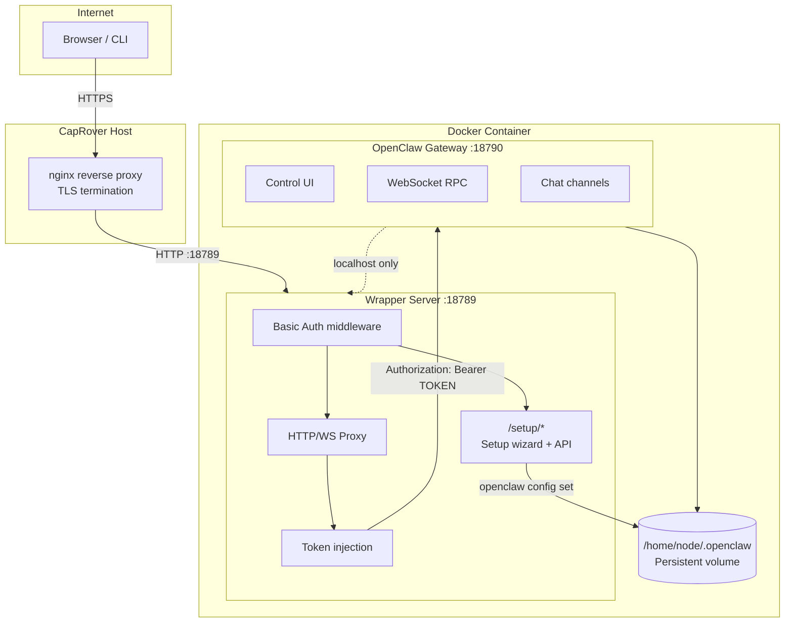
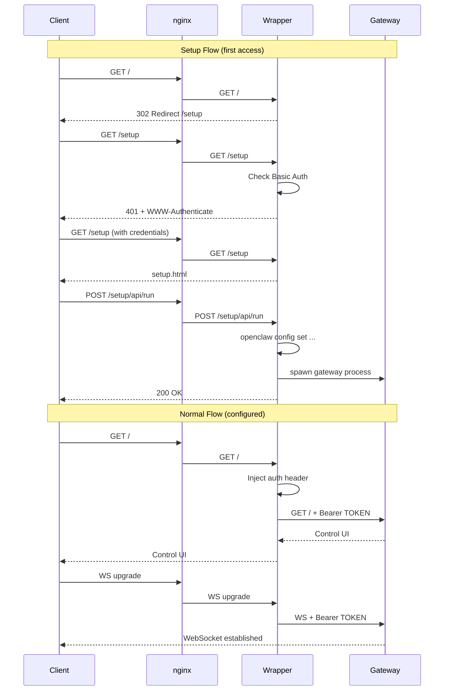

# openclaw-caprover

CapRover one-click app for OpenClaw.

## Architecture



## Request Flow



## Usage

### One-Click App Repository

Add this URL to CapRover's third-party apps:
```
https://raw.githubusercontent.com/Achxy/openclaw-caprover/main/public
```

### Manual Deployment

1. Paste contents of `openclaw.yml` into CapRover's template field
2. Save credentials before deploying
3. Enable HTTPS after deployment
4. Open `/setup` to configure

## Environment

| Variable | Required | Description |
|----------|----------|-------------|
| `SETUP_PASSWORD` | Yes | Basic auth password for /setup |
| `OPENCLAW_GATEWAY_TOKEN` | No | Gateway auth token (auto-generated if not set) |

## Endpoints

| Path | Auth | Handler |
|------|------|---------|
| `/setup` | Basic | Setup wizard |
| `/setup/api/*` | Basic | Configuration API |
| `/setup/export` | Basic | Backup download |
| `/health` | None | Health check |
| `/*` | Token (injected) | Proxied to gateway |
